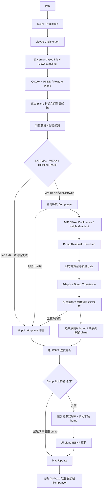

# Super-LIO 退化几何增强

> 2026-09-30 基础 LIO 审查修复见 [lio_review.md](lio_review.md)：已更新平面拟合、IMU 扫描末端同步、去畸变边界和滤波数值回退。下文阶段性“与原版一致”的描述指当时的实现；当前开关关闭与回退均使用修复后的基础 LIO，不再保证与修复前二进制逐数值一致。MID360 的历史实验阈值保留，新增 M2DGR 对比入口单独记录参数。

实现保留原有 IMU propagation、18 维 IESKF 状态、OctVox、HKNN 和 point-to-plane 残差。未增加独立位姿优化器或滑窗。所有新增功能默认关闭，原有配置可以直接运行。

## 阶段 1：只检测，不改变测量更新

阶段 1 使用独立入口，不能用会启用后续模块的 `degeneracy_mid360.launch` 代替：

```bash
source /opt/ros/noetic/setup.bash
source Super-LIO/devel/setup.bash
roslaunch super_lio degeneracy_detection_mid360.launch csv_path:=/tmp/degeneracy_detection.csv
```

该入口开启 `enable_degeneracy`，显式关闭 `enable_bump_layer`、`enable_informed_sampling` 和 `enable_bump_measurement`，覆盖 ROS 参数服务器可能残留的功能开关；固定 `rotation_length_scale=1.0`，直接分析本阶段要求的原 pose 信息矩阵。既有增强版入口继续保留供后续阶段使用。

原 Jacobian 位于 `super_lio.cpp::Observe()` 的 point-to-plane 循环，顺序是 `[机体系旋转, 世界系平移]`。检测读取已经累积好的双精度 `sum_HTVH = Σ 1000 JpᵀJp`；阶段 1 不增删测量行、不改变 `HTVH/HTVr`、不修改 IESKF 求解、IMU propagation 或协方差传播，也不调整采样和地图。新增行为只有几何分析与诊断输出。

`geometry::DegeneracyResult` 含全部六个降序特征值、对应特征向量、ratio、weak_dim、status，另有 valid 标志及弱方向掩码。`Analyzer::analyze()` 使用 `SelfAdjointEigenSolver`；检查输入 NaN/Inf、对称化及缩放后的有限性、分解状态、谱与特征向量有限性、最大特征值接近零以及明显负特征值。失败返回 `valid=false`，ROS 状态为 -1，不将无效分析当作正常几何。

五个阈值均由 `/lio/geometry/` 下同名配置读取：

| 参数 | 默认值 |
|---|---:|
| degeneracy_ratio_enter_weak | 0.01 |
| degeneracy_ratio_enter_degenerate | 0.001 |
| degeneracy_ratio_exit_weak | 0.02 |
| degeneracy_ratio_exit_degenerate | 0.003 |
| degeneracy_eigen_ratio_threshold | 0.02 |

进入使用较低阈值、退出使用较高阈值。阶段 1 每帧首次观测回调推进状态，后续迭代只重算谱和弱方向，防止同一帧内反复推进迟滞。迟滞抑制单一阈值附近的抖动；如果几何比值实际跨越整个进入/退出区间，状态仍可以逐帧变化，并非强制停留若干帧。

阶段 1 验证增加了 Inf、近零谱、计算溢出、负谱、降序、弱维数、阈值附近交替输入和帧内状态保持测试。滤波器回归测试在连续 8 次非零 plane 更新中，对比插入检测回调前后的测量矩阵、姿态、位置、速度、bias、gravity 和后验协方差，要求全部一致。该测试验证检测回调不改变滤波结果；尚不替代真实 rosbag 回放的轨迹对比，实际 TBB 并行累加可能存在浮点求和顺序差异。

## 阶段 2–3：Hybrid OctVox-Bump Map

```bash
roslaunch super_lio degeneracy_map_mid360.launch csv_path:=/tmp/degeneracy_map.csv
```

此入口开启退化检测和附加地图，显式关闭 informed sampling 与 bump measurement。因此本阶段只准备历史几何，滤波仍使用原 plane 测量；不用退化状态作为建图开关。

采用同键附加层：原 `OctVox` 的八个 representative subvoxels、插入算法和 HKNN 代码保持不变；`BumpMap::Cell` 持有 `VoxelGeometryStats geom` 和默认空的 `unique_ptr<BumpLayer>`，而非直接扩展原 `OctVox` 对象布局。两张表使用同分辨率体素索引，附加层独立管理容量和淘汰。它不是与 OctVoxCell 同寿命的内嵌字段，OctVox 的淘汰也不会同步删除附加层；使用有界近期历史及独立 LRU 控制占用。

`geometry.h` 中的公开结构为：

```cpp
struct VoxelGeometryStats {
    Vector3d sum;
    Matrix3d sum_outer;
    uint32_t count;
    Vector3d centroid;
    Vector3d normal;
    Vector3d eigenvalues;
    bool plane_valid;
};
struct BumpLayer {
    double resolution;
    int width, height;
    std::vector<double> image, weight;
    Matrix3d R_CG;
    Vector3d t_CG;
    double mid;
    bool valid;
};
```

统计覆盖该格保留的近期点，而非无限增长的历史计数。每次更新重算 sum、sum_outer、count 和 centroid，使用中心化二次遍历构建协方差，避免远离原点时直接计算 `sum_outer/count - centroid*centroidᵀ` 的数值消减。这里的三个特征值按升序保存，最小模态给出法向；与位姿退化分析的六个降序特征值不同。

延迟创建规则：

1. 少于 `bump_min_points`：记录点统计，平面无效，不分配层。
2. 支撑不足或不满足平面谱比例：平面无效，释放已有层。
3. 平面有效但 roughness 太小：保留有效平面统计，不分配层。
4. 有足够微几何且法向连续两次更新稳定：分配层和图像。
5. 后续平面失效、变成纯平面或体素淘汰：释放相应层；已有图的法向变化超过阈值时重投影旧像素，保留其累计权重。

`pC = R_CG*pG + t_CG`，其中新建图的 `t_CG = -R_CG*centroid`。图像分辨率存于层内，像素仅积累真实样本的距离权重。`valid` 表示层含有限的有效图像数据，不保证任意查询位置都有四邻域；查询仍检查平面有效性和四个像素的观测权重。

关闭 `enable_bump_layer` 时不创建 BumpMap。开启后并非每个格都分配高度图，但未激活格仍会占用有界样本历史和统计内存。`stats(point)` 与 `layer(point)` 提供只读检查接口，返回指针不得跨 `insert()` 保存。

新增 `geometry_map` 回归测试：稀疏格不分配图像、纯平面统计有效但无图像、稳定微几何延迟创建、统计与实际样本一致、近期历史替换和淘汰释放，以及开启附加地图前后相同 OctVox 输入的 HKNN 邻点、距离完全一致。

## BumpLayer 激活条件：建图与测量分离

**Map Preparation** 只受 `enable_bump_layer` 和局部几何条件控制。`InitGeometry()` 按开关创建附加地图，`UpdateBumpMap()` 在后验位姿下插入去畸变点；这条调用路径不检查 NORMAL / WEAK / DEGENERATE，也不要求开启 `enable_bump_measurement`。因此可在正常环境提前积累历史。

`BumpMap::rebuild()` 在以下条件全部满足后才分配 BumpLayer：

```text
retained_point_count >= bump_min_points
&& plane_valid
&& normal_stable_between_updates
&& sqrt(min_geometry_covariance_eigenvalue) >= bump_min_roughness
```

`local_roughness` 是相对主平面的 RMS 法向起伏，单位为米，使用局部三维协方差最小特征值的平方根。平面有效性要求至少两个方向有空间支撑且满足谱比例。法向先消除正负号歧义，再检查相邻两次有效更新的夹角不超过 `bump_plane_reproject_angle_deg`。第一次合格更新只记录法向，第二次稳定更新才可建层；同一次插入中的点数增加不会充当两次稳定性观测。上述稳定性条件约束首次建层。已有有效层在平面仍有效、起伏仍足够时，法向变化超过阈值执行旧图重投影；不把新坐标系当成首次建层。平面无效或起伏不足仍释放层。

**Measurement Activation** 是另一条路径：`Observe()` 必须同时满足 bump measurement 开启、地图存在、当前退化分析有效且为 WEAK / DEGENERATE，才尝试查询候选。随后还需通过像素四邻域、MID、梯度、置信度、弱方向贡献、残差及协方差检查。仅存在 BumpLayer 不会激活测量；NORMAL 和无效退化分析都禁止 bump 测量。

五个要求的参数已在 `/lio/geometry/` 下配置：

| 参数 | 默认值 | 含义 |
|---|---:|---|
| enable_bump_layer | false | 是否准备附加地图 |
| bump_min_points | 30 | 每格保留历史的最少点数 |
| bump_min_roughness | 0.002 | 最小 RMS 法向起伏，米 |
| bump_resolution | 0.05 | 图像像素分辨率，米 |
| bump_plane_reproject_angle_deg | 5.0 | 首次建层稳定性与旧图重投影角度阈值，度 |

参数启动时读取；本阶段可继续使用 `degeneracy_map_mid360.launch` 验证“准备地图但不参与滤波”。新增回归用同一份历史图验证 NORMAL 拒绝、退化后通过候选 gate，以及点数不足、起伏不足、非平面时不分配层，以及已有层法向变化时的重投影。测试中的低测量门限仅用于隔离激活逻辑，不修改运行默认配置。

## Bump Image 增量更新与旧图重投影

`BumpMap::insert()` 计算新观测的距离权重，`rebuild()` 更新平面统计并处理图像。变换使用 `pC = R_CG*pG + t_CG`，像素坐标为 `u=xC/resolution+u0`、`v=yC/resolution+v0`；`u0,v0` 将局部原点移到图像中心，像素高度为 `h=zC`。

每个新点分配到最近像素，执行：

```text
wi = min(bump_range_weight_max, 1/(range + bump_range_epsilon))
W_new = W_old + wi
I_new = I_old + wi/W_new * (h - I_old)
```

最后一式与 `(W_old*I_old + wi*h)/(W_old+wi)` 等价，避免直接形成大的 `W_old*I_old` 中间值。参数 `bump_range_weight_max` 默认为 1.0，`bump_range_epsilon` 默认为 0.1，两者均通过 `/lio/geometry/` 加载。单次权重有上限，累计权重没有另设上限或时间衰减；非有限点、权重、累计值不写入图像。

首次延迟分配时，仅将保留的样本历史注入一次。已有层用单独的 pending 集合收集本次新点，既不重放历史，也不在重投影后再次注入建层历史。pending 在本次地图更新结束后释放；像素数组尺寸固定，平面样本窗口仍受 `bump_history_points` 限制。

当新平面法向与旧图法向夹角大于 `bump_plane_reproject_angle_deg` 时：

1. 使用新法向和当前 centroid 建立新 `R_CG,t_CG`。
2. 对每个已观测旧像素，构造旧局部点 `[(u-u0)*resolution, (v-v0)*resolution, I_old]`。
3. 经 `pG = R_oldᵀ*(pC_old-t_old)` 返回世界系，再变换到新局部系。
4. 将其投到新图最近像素，以旧像素累计 `W_old` 为权重融合新的局部高度；多个旧像素落入同一新像素时仍按权重合并。
5. 加入本次新观测，最后从已观测像素重新计算 MID。

采用最近像素投射而非向四周填充，避免同一旧像素在多个新像素产生重复置信度。不主动填洞。落在新图范围外或非有限的投影被丢弃；测试在全部投影位于图内时验证旧总权重守恒，以及变换后的加权高度一阶矩守恒。

重投影使用旧像素中心及平均高度，是对原始三维样本的近似；反复重投影可能引入离散化误差。平面无效、起伏不足或 LRU 淘汰仍释放整层，不保留无效图像。

回归测试对三个不同观测距离逐像素比较“增量结果”和独立批量加权参考，覆盖权重上限、range epsilon、历史窗口装满后不重放、空更新不重复累积，以及法向变化后旧置信度保留与新观测仅计一次。

## MID：只统计有效像素的平均绝对高度

`BumpLayer::updateMid()` 在增量融合及重投影后的新点融合结束后统一计算：

```text
Ωobs = { i | W[i] > 0 且 W[i]、I[i] 均为有限数 }
MID = Σ(i∈Ωobs) |I[i]| / |Ωobs|
```

未观测像素、非有限高度、非有限或非正权重不进入分子和分母。已观测且高度恰好为零的像素仍计入分母。每个有效像素计一次，MID 不按累计置信度再次加权，也不除以整幅图像面积。实现用在线平均避免直接求和溢出。图像尺寸不匹配或有效像素为空时，MID=0 且层标记为无效。查询和重投影也使用同一 `observedPixel()` 判定。

MID 单位为米，表示相对当前高度图参考平面的平均绝对偏离。较大值提示潜在微几何，较小值提示接近参考平面；噪声或参考平面误差也可能抬高 MID，因此它不是微几何质量或可观性恢复的证明。

用途保持分离：

- 地图引导采样以 `mid_threshold` 和 Top-K 区域筛选保留细采样点；这是候选区域选择。
- 测量候选须满足 `bump_min_mid`，MID 再通过 `bump_mid_scale` 归一化为质量因子之一。
- 完整方法还检查梯度、像素置信度、弱方向投影、残差和自适应方差。高 MID 不能跳过这些 gate，尤其不代表补偿当前弱方向。

新增测试使用含未观测大高度、已观测零高度、正负高度、NaN/Inf 和不同像素权重的图像验证精确期望值，并验证高 MID 在梯度为零、置信度不足或弱方向无贡献时仍被拒绝。仅消融实验允许关闭弱方向筛选；完整方法保持 `enable_weak_selection=true`。

## 阶段 4：Degeneracy-Aware Map-Informed Sampling

```bash
roslaunch super_lio degeneracy_sampling_mid360.launch
```

此入口开启检测、地图准备和 informed sampling，仍关闭 bump measurement，便于单独评估采样变化。

`DownSample()` 先执行原 `VoxelGridClosest` center-based 采样，再用当前 IESKF prior、OctVox/HKNN 和 plane 几何信息检查退化。`informedSample()` 只在 WEAK / DEGENERATE 且存在有效历史高度图时改变采样结果。NORMAL、功能关闭、地图不可用或退化分析无效时，不替换原输出，保持点值、顺序及 header。

退化分支按以下顺序执行：

```text
去畸变点云 → fine center-based downsample
           → 用当前 IESKF prior 转到世界系查询 MID
           → 对 MID 达标体素排序，选择配置的 Top-K
           → 选中体素保留 fine 点
           → 其余 fine 点再做 coarse center-based downsample
           → 合并两组原始代表点，保持输入时间戳
```

仅地图查询使用世界系，输出仍为去畸变后的机体系点，不将 prior 变换重复应用到点云。fine 和 coarse 输入互斥，同一输入点不会重复出现。MID 相同时按体素键排序，保证 Top-K 的确定性。阈值达标但超出 Top-K 的体素进入 coarse 分支；没有任何达标体素但地图仍可用时，全部点进入 coarse 分支。

五个参数位于 `/lio/geometry/`：

| 参数 | 默认值 |
|---|---:|
| enable_informed_sampling | false |
| fine_resolution | 0.1 m |
| coarse_resolution | 0.5 m |
| mid_threshold | 0.005 m |
| informed_top_k_voxels | 100 |

Top-K 为可配置上限，不固定为 300。配置校验要求分辨率为正、coarse 不小于 fine、Top-K 为正。采样使用 prior 选择历史区域，不用本帧后验位姿或尚未插入的当前帧高度图。

实现位于 `informed_sampling.h/.cpp`。`SamplingResult` 返回是否应用、选中体素数、fine/coarse 输出点数，供测试和调用方检查。新增回归覆盖 NORMAL 原输出完全不变、失效回退、非单位 prior 变换、高 MID 保留细点、低 MID 粗采样、Top-1/Top-2、coarse 分辨率配置、输出时间戳与点索引无重复。MID 在本模块仅用于选择采样密度，不是最终 bump 测量接受标准。

## 策略 A：Plane/Bump 测量互斥

完整方法固定采用 **mutually exclusive**。未增加“同时保留 plane 并降低权重”的策略 B 开关。

`Observe()` 先按原逻辑构建全部有效 plane 行，用其信息矩阵进行退化检测。随后计算候选 bump 的质量、协方差并完成 Top-K 筛选。仅最终选中的点索引进入 `applyExclusiveBumps()`：

```text
A_new = A_old - JpᵀJp/Rp + JbᵀJb/Rb
b_new = b_old + Jpᵀrp/Rp - Jbᵀrb/Rb
```

索引是本帧采样点的索引，每次迭代重新构造，不跨帧复用。同一点最终只贡献一行：普通点保留 plane；满足 MID、梯度、像素置信度、弱方向与残差 gate 且入选的点使用 bump。

该接口检查原 plane 有效性、点索引范围、Jacobian/残差有限性及正有限方差，并对重复索引去重。非法候选保留原 plane，不能先删 plane 再因 bump 无效丢失观测；没有选中点时不改变输入矩阵。未入 Top-K 的候选也不会移除 plane。接受计数和 plane 计数按实际替换后的集合统计。

plane 信息矩阵只用于前置退化检测，并非随后再次作为另一组重复观测加入 IESKF。既有异常修正回退仍关闭本帧 bump 并重跑纯 plane 更新。

回归测试直接比较“全 plane 信息减掉被选中的行、再加入 bump”与“仅未选中 plane + bump”的独立组装结果，覆盖信息矩阵和右端项符号；另外验证相同 Jacobian、残差和方差的替换不增加信息、重复索引只替换一次、非法方差/索引回退、空选择保持原测量。

## Bump Measurement Quality：四因子归一化

每个通过基础 gate 的 `Candidate` 显式保存四个归一化因子、原始弱方向贡献、局部质量和 robust 权重：

```text
weak_score = Σ(k∈D) (J̃b vk)²
w_mid   = clamp(MID / bump_mid_scale, 0, 1)
w_grad  = clamp(norm(height_gradient) / bump_gradient_scale, 0, 1)
w_pixel = clamp(min_neighbor_confidence / bump_pixel_scale, 0, 1)
w_weak  = clamp(weak_score / bump_weak_scale, 0, 1)
local_quality = clamp(w_mid * w_grad * w_pixel * w_weak, 0, 1)
```

`weak_score` 是未归一化平方投影和，可能大于 1，不能直接当作有界质量因子；`w_weak` 才参与乘积。它使用与退化谱相同的旋转尺度 `J̃b=Jb S`。pixel confidence 取双线性四邻域累计权重的最小值，经 scale 和 clamp 后参与质量计算。四个 scale 都由 `/lio/geometry/` 下同名参数控制。

保留既有 Huber 降权，但将其与本节的四因子质量分开表示：

```text
robust_weight = 1 if abs(rb) <= huber_delta else huber_delta/abs(rb)
quality = clamp(local_quality * robust_weight, 0, 1)
```

最终 `quality` 用于筛选、排序和自适应协方差，满足 `0 <= quality <= local_quality <= 1`。局部质量乘积不因 Huber 混入而失去可检查性。仅弱方向选择消融关闭时显式令 `w_weak=1`，完整方法仍使用真实归一化弱方向贡献。

输入仍先经过最小 MID、最小梯度、最小像素置信度、最小弱方向贡献和残差 gate；clamp 不用于掩盖无效输入。非有限 Jacobian、特征向量、ratio 或弱方向平方和被拒绝，尤其不允许将溢出的 weak_score clamp 成 1 而误判为高质量。

回归覆盖四因子各为 0.5 时质量精确等于 0.0625、Huber 单独降权、超大有限输入上限饱和、弱方向能量溢出拒绝、负 MID 与 NaN 拒绝。之前的高 MID 不可绕过其他 gate 的测试继续保留。

## 阶段 6：Weak-Direction Constraint Selection

选择依据为当前 plane 几何谱的弱方向集合 D，而不是单独按 MID 或梯度大小排序。对每个候选计算：

```text
weak_score_i = Σ(k∈D) (J̃b_i vk)²
score_local_i = w_mid * w_grad * w_pixel * w_weak
score_i = score_local_i * robust_weight_i
```

弱方向投影使用当前迭代的谱和相同的旋转尺度，`w_weak` 是归一化并 clamp 后的 weak_score。候选通过全部质量 gate、协方差有效性检查后，由统一的 `selectWeakDirectionConstraints()` 处理最终选择：

1. NORMAL 或无效几何分析时清空 bump 选择。
2. 要求 `score_i > weak_direction_score_threshold`，等于阈值也不接受。
3. 按 score 降序排列，同分按本帧点索引升序排列。
4. 同一点索引仅保留最高评分候选，最多保留 `max_bump_constraints` 条。
5. 仅最终集合参与 plane/bump 互斥替换；被拒绝、未入选或没有有效候选时保留对应 plane。

本版本组合使用“严格阈值 + Top-K 上限”。Top-K 不强制凑满，退化严重也不会无条件扩大候选数量。完整方法开启 `enable_weak_selection=true`；关闭仅用于消融。

参数均在 `/lio/geometry/` 下。需求中的三个 min 名称沿用项目已有的 bump 前缀，避免两组配置产生歧义：

| 需求参数 | 实际配置名 | 默认值 |
|---|---|---:|
| weak_direction_score_threshold | weak_direction_score_threshold | 0.001 |
| max_bump_constraints | max_bump_constraints | 200 |
| min_mid | bump_min_mid | 0.003 m |
| min_gradient | bump_min_gradient | 0.03 |
| min_pixel_confidence | bump_min_pixel_confidence | 0.1 |

另有 `bump_min_weak_score` 对未归一化弱方向贡献设置硬门限，默认 0.001。既有拒绝计数、最终接受数及平均 weak_score 诊断继续适用。

新增测试构造斜向弱特征向量，验证高 MID 但与弱方向正交的观测被拒绝，MID 较低但沿弱方向的观测可通过；同时覆盖严格阈值、可配置 Top-K、重复点不占名额、同分确定性及 NORMAL/无效分析关闭选择。此指标检验当前弱子空间的投影，不保证约束分布覆盖每一个弱模态，也不等价于互斥替换后所有方向的信息都增加。

## Adaptive Measurement Covariance：质量决定滤波信任程度

`adaptiveBumpVariance()` 实现有上下界的逐观测方差计算：

```text
Rb_i = clamp(sigma_b_base² / (quality_i + 1e-12),
             sigma_b_min², sigma_b_max²)
```

输入 sigma 是标准差（米），输出 `Candidate::variance` 是方差（米²），不会把 sigma 当成 R 直接送入滤波。默认 `sigma_b_base=0.03`、`sigma_b_min=0.01`、`sigma_b_max=0.3`。无额外退化因子时，例如 quality 为 1、0.5、0.1 时，Rb 分别约为 0.0009、0.0018、0.009 m²。触及上下界后出现平台，所以 Rb 随质量提高单调不增，而非始终严格下降。

现有完整方法还保留后续“全局退化程度”扩展，它在同一函数中以可选 `variance_factor` 乘到分子上；默认参数为 1，独立调用即为本节公式。运行时把 `/lio/geometry/bump_degenerate_variance_factor` 设为 **1.0** 即关闭该扩展，精确评估本节的质量自适应；当前完整配置默认 0.5，按严重程度插值至该值。所有模式仍受相同方差上下界保护。

计算发生在质量 gate 之后。低于选择阈值的观测直接拒绝，不因方差上限而重新获准；quality=0 的函数边界测试仅验证数学上限，不代表运行时接受零质量测量。非法质量、非有限/非正 sigma 或无效方差范围返回失败，保留原 plane 测量。

每条最终选中的 bump 通过 `applyExclusiveBumps()` 以自身 Rb 累积 `JbᵀJb/Rb` 和 `-Jbᵀrb/Rb`，这两个量直接进入原 IESKF 更新。没有只改变候选排序却仍使用固定滤波权重，也没有修改 IMU 噪声、传播协方差或主状态。

回归测试覆盖精确公式、质量扫描单调性、上下限、可选严重程度因子和非法输入；滤波器测试使用质量 0.9 与 0.05 生成各自 Rb，对相同 prior/Jacobian/目标观测执行更新，验证高质量观测产生更大的弱方向修正和更小的该方向后验方差。这个结论针对受控测试，并不表示任意场景都能凭自适应 R 恢复可观性。

## 全局退化程度：仅调节已合格观测的方差

`degeneracySeverity()` 独立计算全局程度：

```text
rho_normal = degeneracy_ratio_exit_weak
rho_degenerate = degeneracy_ratio_enter_degenerate
d = clamp((rho_normal-rho)/(rho_normal-rho_degenerate+1e-12), 0, 1)
```

该标量不是新的状态机：NORMAL / WEAK / DEGENERATE 仍由既有迟滞决定；d 用于已激活且局部可靠候选的连续方差调节。非法 ratio 或退化阈值区间返回失败。`Candidate::degeneracy_severity` 保存 d，`variance_factor` 保存最终分子缩放系数，便于区分局部质量与全局调节。

采用方差插值，不放大全局质量分数：

```text
sigma_weak = sigma_b_base
sigma_deg = sigma_b_base * sqrt(bump_degenerate_variance_factor)
sigma_global² = (1-d)*sigma_weak² + d*sigma_deg²
variance_factor = (1-d) + d*bump_degenerate_variance_factor
Rb = clamp(sigma_global²/(quality+1e-12), sigma_b_min², sigma_b_max²)
```

默认 `bump_degenerate_variance_factor=0.5`，因此 `sigma_deg≈0.707*sigma_weak < sigma_weak`。参数在 `(0,1)` 时符合更强退化使用更小基础方差的要求；1.0 专用于关闭全局调节的消融，不表示更强信任。质量、最终数量上限和 IMU covariance 均不因 d 自动改变。方差触及上下界时允许出现平台。

执行顺序保证：MID、梯度、像素置信度、弱方向贡献、残差、Huber 后的质量阈值全部通过，才计算 d 和 Rb。严重退化不能提高原本不合格观测的分数，也不会将其重新加入候选。完整方法必须保持 `enable_weak_selection=true`；关闭弱方向检查仅用于消融，不提供上述完整可靠性保证。

回归覆盖 d 的端点、中点、clamp 和非法输入；对相同局部观测扫描 rho，验证 quality 保持不变而方差单调不增；在 d=1 时分别破坏 MID、梯度、像素置信度和弱方向贡献，均必须拒绝；因子设为 1 时，不同退化程度得到相同 Rb。

## Bump Measurement Gate：地图与测量两层拒绝

安全门分布在 `BumpMap::query()`、`BumpLayer::query()` 和 `candidate()`，任何一步失败都不进入最终 bump 集合：

| 拒绝条件 | 检查位置与行为 |
|---|---|
| BumpLayer 缺失或 invalid | 地图/层查询返回 false |
| plane invalid | 地图查询在访问层之前检查 `geom.plane_valid` |
| pixel unobserved | 四邻域任一权重非正即拒绝 |
| bilinear neighbors insufficient | 边界不足、尺寸不足、数组尺寸不符均拒绝，不补像素 |
| MID too low | `MID < bump_min_mid` |
| gradient too low | `gradient < bump_min_gradient` |
| pixel confidence too low | 四邻域最小权重 `< bump_min_pixel_confidence` |
| weak score too low | 完整方法中 `weak_score < bump_min_weak_score` |
| residual too large | `abs(rb) >= bump_residual_max`，正负残差一致处理 |
| NaN / Inf | 查询点、坐标变换、分辨率、像素高度/权重、插值结果、Surface、Jacobian、弱方向谱、评分及方差检查 |

像素查询先检查变换后的浮点坐标有限且有完整邻域，再进行整数索引转换，避免无穷坐标或巨大值转换为索引。输出 residual、normal、gradient、confidence 全部有限才返回成功。失败时清空 Surface；候选处理开始时清空上次的质量和方差，仅保留本帧点索引，防止调用方复用对象时读到旧接受结果。

五个参数均由 `/lio/geometry/` 配置：`bump_residual_max=0.15`、`bump_min_mid=0.003`、`bump_min_gradient=0.03`、`bump_min_pixel_confidence=0.1`、`bump_min_weak_score=0.001`。最小值 gate 使用 `<`，因此等于最小值仍需继续通过后续质量检查；按更新后的 Phase 5 要求，残差绝对值必须严格小于最大值，等于最大值也拒绝。最终质量阈值仍为严格 `>`。弱方向 gate 仅在显式消融关闭 weak_selection 时跳过，完整方法始终开启。

观测被拒绝时不先移除原 plane；只有最终合法、入选的 bump 才通过互斥替换接口移除对应 plane 行。地图类拒绝计入 `rejected_by_map`，已有质量 gate 使用相应拒绝计数；并非每一种数值错误都有独立 ROS 计数。

新增测试覆盖四个邻居逐一缺失、图像边界、层无效、平面无效、数组尺寸不符、非有限像素/变换/测量字段、浮点坐标溢出、正负残差边界和复用候选的旧数据清理。原有 MID/gradient/pixel/weak gate、非法方差、空选择和 plane 保留测试继续保留。

## Robust Kernel：Huber 残差降权

`huberWeight(rb, delta)` 实现 Huber IRLS 权重：

```text
wr = 1                  if |rb| <= delta
wr = delta / |rb|       if |rb| > delta
quality = clamp(local_quality * wr, 0, 1)
Rb = clamp(sigma_global²/(quality+epsilon), sigma_min², sigma_max²)
```

`delta = /lio/geometry/bump_huber_delta`，默认 0.03 m。正负残差对称，零残差及恰好位于 delta 的残差权重为 1；无效残差或非正/非有限 delta 返回零权重并拒绝。使用显式分段公式，不在 Huber 分母中加入固定 epsilon，避免 delta 很小时将零残差错误降权。协方差计算中的 epsilon 仍保留。

执行顺序为：硬 residual gate → Huber 权重 → 最终质量阈值 → 退化程度调节及 Rb → IESKF。达到或超过 `bump_residual_max` 的观测直接拒绝，不仅仅降低权重。Huber 降权后若 quality 不达标，同样拒绝。

自适应模式中，wr 只通过质量进入一次 Rb；信息矩阵继续使用 `1/Rb`，不再额外乘一次 wr。固定协方差消融模式中使用 `Rb = sigma_base²/wr`，保留同样的 Huber 影响，但不使用局部质量调节方差。两种模式均不把残差本身再次乘 wr。

在局部质量和全局程度相同、方差未触及上下界时，残差从 delta 变为 2*delta 会使 wr 从 1 变成 0.5，质量减半，方差约增大一倍。最终状态修正还受 residual 大小和先验影响，不能简单解释为状态修正一定减半。

新增回归覆盖阈值内、阈值处、阈值外、正负对称、极小合法 delta、非法输入，以及自适应/固定模式中的单次降权和降权后质量拒绝。

## 最终 Measurement Update：三种状态的测量组合

现有 IESKF 使用信息形式，不必显式分配大矩阵 H 和对角阵 R；实际传入的是 `A=HᵀR⁻¹H` 与 `b=-HᵀR⁻¹r`。它等价于下面的测量堆叠：

| 状态 | 最终测量行 | 方差 |
|---|---|---|
| NORMAL | 原有效 plane 行 | 原 `Rp=0.001 m²` |
| WEAK | 未被替换的可靠 plane + selected bump | `diag(Rp, Rb_i)` |
| DEGENERATE | 未被替换的可靠 plane + weak-direction-effective bump | `diag(Rp, Rb_i)`，合格 bump 的 Rb 允许受更强全局程度调节 |

这里明确采用保守的 plane 策略：需求示意中的 `R_plane_adjusted` 在本实现中对通过原可靠性筛选的 plane 行仍等于原 R_plane，没有新增按退化程度缩放 plane 方差。plane 的可靠性通过原 HKNN 邻域数量、拟合平面支持距离及 point-to-plane residual gate 处理，不可靠行不进入测量矩阵。不能将它描述成已经实现了新的逐 plane 连续协方差估计。

bump 的可靠性单独经过历史层有效性、双线性支持、MID、梯度、像素置信度、弱方向贡献、残差和 Huber/quality gate，随后使用各自的自适应 Rb。相同采样点的 plane 和 bump 互斥；未入选或无效 bump 保留其原 plane。没有有用 bump 时退回纯 plane 测量。NORMAL 不激活 bump，也不修改原 plane 信息。

退化只允许改变已合格 bump 的方差，不统一乘整个 LiDAR 信息矩阵。保留 plane 的 `1/Rp=1000` 在所有状态下相同；弱方向分析始终先读取完整的原 plane 信息，再进行替换。IESKF 主状态、迭代求解、IMU propagation 及 IMU covariance 均沿用原实现。

新增滤波器回归在 NORMAL / WEAK / DEGENERATE 下分别验证“有用 bump”和“全部 bump 拒绝”共六种情况。每次迭代独立构造显式 H/r/diag(R)，与互斥替换得到的 A/b 对比，再将两种构造分别送入原 IESKF，对比所有状态分量和后验协方差。测试同时检查：不可靠 plane 不入栈、不同 bump 使用不同方差、每个有效点仅一行、保留 plane 的精度始终为 1000。

## 第一版边界：不修改 IMU covariance

退化增强只控制新增 bump 测量的 Rb，不依据退化状态调整 IMU 先验强弱。以下内容保持原实现：

- `Qimu`：`ESKF::BuildNoise()` 的 Q 对角项与噪声映射。
- P propagation：`P = F_X*P*F_Xᵀ + F_W*Q*F_Wᵀ` 及 F_X/F_W 构造。
- gyro/acc noise、gyro/acc bias random walk：默认值、参数读取与传感器配置。
- 传播初始协方差与 IMU Predict 状态计算。

没有引入 direction-aware covariance inflation，也没有按弱方向修改 P 的特征值或通过 `SetCov()` 主动放大先验。后验 P 会因正常 measurement update 中的 Rb 变化而变化，这是原 IESKF 的更新结果，不是更改 IMU covariance 模型。下一帧仍使用原传播公式从这个后验出发。

审计相对仓库 HEAD 验证：ESKF.cpp 中 measurement update 之前的全部代码逐字一致，包含初始化、BuildNoise、状态注入以及两个 Predict 实现；ESKF.h 的状态维度和 IMU 默认选项一致；params 声明、定义及 ROS 参数加载文件一致；8 个原有受版本控制的传感器/config YAML 文件一致。

ESKF 源文件已有的增强改动仅为 `UpdateObserve()` 增加可选 correction guard，在应用异常修正前返回失败。调用方随后恢复完整滤波器副本并重跑纯 plane；它不改写 Q、传播公式或噪声参数。

未来如果真实回放实验表明 IMU prior 过强，应将 direction-aware covariance inflation 作为独立实验评审和验证；本版本不启用、不预留隐式触发路径。

## Phase 5 验收：Degeneracy-Aware Bump Measurement Update

按更新后的 Phase 5 提示词，使用独立入口：

```bash
source /opt/ros/noetic/setup.bash
source Super-LIO/devel/setup.bash
roslaunch super_lio degeneracy_measurement_mid360.launch csv_path:=/tmp/phase5.csv
```

入口明确开启退化检测、BumpLayer、前阶段的 informed sampling、bump measurement、弱方向质量与 adaptive covariance，并覆盖可能残留的消融开关。`bump_degenerate_variance_factor=1.0`，使本阶段使用精确的 `clamp(sigma_base²/(quality+epsilon), sigma_min², sigma_max²)`，不叠加可选的全局退化程度调节。完整增强入口 `degeneracy_mid360.launch` 仍保留其原配置。

| 必须项 | 当前实现与验证 |
|---|---|
| bump residual | `BumpLayer::query()`：`rb=zC-I(u,v)`，四邻域有效性检查 |
| bump Jacobian | 本项目右乘机体系旋转、世界系平移的完整高度梯度链式求导；真实高度图六维有限差分验证 |
| measurement gating | 地图/平面/像素/数值有效性、最小局部质量及严格 `abs(rb)<bump_residual_max` |
| measurement quality | MID、梯度、置信度、弱方向投影逐项归一化与 clamp；乘积后施加 Huber |
| adaptive covariance | 每条观测独立有界 Rb，进入原 IESKF 信息矩阵与残差右端项 |
| double-counting suppression | 最终选中的点用 bump 替换其 plane；未选中或拒绝的点保留 plane |

NORMAL 仅使用 plane；WEAK / DEGENERATE 使用可靠 plane 与当前弱方向有效的合格 bump。没有有效 bump 时回退纯 plane。现有异常修正保护恢复完整滤波器副本，再重跑纯 plane。IMU Q、P propagation、噪声和主状态保持原实现。

此版本把先前 residual gate 的边界从 `<=` 明确改为严格 `<`，测试覆盖正负边界、紧邻边界内和边界外。所有相关参数由 `geometry_options.def` 和 `config/geometry.yaml` 提供；本启动入口显式固定必要的功能选择，不以固定 bump 权重代替 adaptive covariance。

验收限于编译、单元/滤波器回归与启动参数检查；尚无实测 rosbag/真值轨迹的性能结论。本阶段完成后停止，不自动开展后续阶段或修改 IMU covariance。

## 整体系统流程与代码对应



图中的测量构造属于原 `UpdateObserve()` 的迭代回调，没有额外的位姿优化器。每次回调先累积完整 plane 信息，再进行退化分析，最后才替换选中的测量行，因此 bump 信息不会混入用于检测退化的 `Gp`。

| 流程节点 | 代码入口 |
|---|---|
| 帧级调度与更新顺序 | `super_lio.cpp::stateProcess()` |
| IMU prediction 和去畸变 | `super_lio.cpp::Propagation_Undistort()` |
| 初始采样与可选 MID 双分辨率采样 | `super_lio_geometry.cpp::DownSample()` |
| 采样前的当前帧 plane 几何检查 | `super_lio.cpp::AnalyzeSamplingGeometry()` |
| HKNN、plane 残差与信息累积 | `super_lio.cpp::Observe()` |
| 谱分析、弱方向及迟滞 | `geometry.cpp::Analyzer::analyze()` |
| 历史高度图、像素置信度及梯度 | `geometry.cpp::BumpMap::query()` |
| Jacobian、弱方向评分与逐条协方差 | `geometry.cpp::candidate()` |
| 最终 Top-K、互斥组合与异常回退 | `super_lio.cpp::Observe()` |
| IESKF 求解及状态更新 | `ESKF.cpp::UpdateObserve()` |
| 后验位姿下的地图更新 | `super_lio.cpp::UpdateMap()` / `super_lio_geometry.cpp::UpdateBumpMap()` |

开启 informed sampling 时，在上述主测量回调前增加一次“初始 plane → 当前帧退化检查”：只有退化分支才查询 MID 并调整采样，随后使用最终采样点重新构建正式测量。不开启该采样功能时，首次测量回调直接完成帧级分类。两种情况下迟滞每帧只推进一次，迭代内更新特征值和弱方向。

质量筛选分两层：低质量或无效观测先被 gate 拒绝；合格候选计算 `Rb` 后，再进行最终质量排序和数量限制。NORMAL 不查询 bump 测量，也不改变 plane 权重；若开启附加地图，它仍在后验地图更新阶段积累历史。开启 bump measurement 时，无最终有效 bump 会同时撤销本帧 informed sampling，从原 IESKF prior 和原 center-based 点云重跑纯 plane 更新。仅采样消融（关闭 bump measurement）保留采样结果。

## 五个模块

- **Geometry Degeneracy Analyzer**：从通过原有 gate 的 plane 行构建 `G = Σ 1000 Jp Jpᵀ`，不是无权近似。降序输出特征值、弱方向和 NORMAL / WEAK / DEGENERATE；使用进入/退出阈值迟滞。空信息、非有限输入或特征分解失败不激活 bump。迟滞每帧只推进一次，迭代中重新计算谱。
- **Hybrid OctVox-Bump Geometry Layer**：附加层使用与 OctVox 相同分辨率的 floor 整数体素键，不修改 OctVox 的代表点或 HKNN。独立 LRU 容量限制；每格保留有上限的近期样本，仅稳定且有微小起伏的平面延迟创建高度图。完整去畸变点云在滤波完成后进入附加层，正常帧也建图。
- **Degeneracy-Aware Map-Informed Sampling**：先运行原 center-based 采样。在 IMU prior 下通过原 HKNN 和 plane gate 检查当前帧几何，仅 WEAK / DEGENERATE 时按地图 MID 排序选 Top-K 区域，使用 fine/coarse 双分辨率。地图不可用时保持原采样；地图可用但没有达标的高 MID 区域时使用 coarse 采样。启用此模块会增加一次对应关系搜索。
- **Weak-Direction Bump Constraint Selection**：有效四邻域双线性插值，计算高度梯度；按 MID、梯度、像素置信度和弱方向投影的归一化乘积筛选并排序。限制最大行数。同一点选中 bump 后移除其 plane 行，未选中的点仍使用原 plane。
- **Adaptive Measurement Covariance**：Huber 权重进入质量，`Rb = clamp(sigma_base² * severity_factor / (quality + epsilon), sigma_min², sigma_max²)`，逐条以 `1/Rb` 加入原 IESKF 信息矩阵。严重退化只在局部质量 gate 全通过后降低方差。

## 核心数学模型：扰动、梯度和信息矩阵

本文公式使用行 Jacobian `J ∈ R^(1×6)`；代码 `poseJacobian()` 返回其转置列向量。因此本文的 `Jᵀ W J` 对应代码的 `J * W * J.transpose()`。

### Point-to-plane 与几何谱

令 `pB` 为去畸变后的 IMU 机体系点，`pW = R pB + t`，地图单位法向为 `n`，平面参考点为 `q`：

```text
rp = nᵀ(pW - q) = nᵀpW + d,  d = -nᵀq
δξ = [δθB; δtW]
R' = R Exp([δθB]×),  t' = t + δtW
∂pW/∂δξ = [-R[pB]×, I₃]
Jp = [-nᵀR[pB]×, nᵀ]
Jpᵀ = [pB × (Rᵀn); n]
Gp = Σ Jpᵀ Wp Jp,  Wp = 1000 = 1/Rp
```

这里使用原代码的 plane 权重，对应 `Rp = 0.001 m²`；它是现有配置的测量模型，不表示已经从数据标定出这个噪声方差。法向和对应关系在一次线性化求导期间固定。

旋转与平移量纲不同。设 `L = rotation_length_scale`（默认 1 m），定义：

```text
δη = [L δθB; δtW],  δξ = S δη
S = diag(1/L, 1/L, 1/L, 1, 1, 1)
J̃p = Jp S
G̃p = Sᵀ Gp S = V Λ Vᵀ
Λ = diag(λ1, ..., λ6),  λ1 ≥ ... ≥ λ6 ≥ 0
rho = λ6 / (λ1 + epsilon)
D = { k | λk / (λ1 + epsilon) < tau_weak }
```

代码对对称化后的 `G̃p` 分解，默认 L=1 时与原 `Gp` 一致。输出的特征向量位于 `δη` 坐标系；其原始 pose 方向为 `S vk`。弱方向评分也必须使用 `J̃b = Jb S`。L 只参与几何分析，不缩放实际 IESKF 状态或更新矩阵。实现用 `epsilon = 1e-12`，并在分母计算前拒绝 `λ1 <= 1e-12`、非有限矩阵、显著负特征值和分解失败，避免将无效谱解释为可用退化观测。

### Bump residual 的完整链式求导

设固定历史地图的局部坐标变换为 `pC = RCW(pW - origin)`，像素分辨率为 `s`（米/像素），图像原点偏移为 `(u0,v0)`：

```text
u = xC/s + u0,  v = yC/s + v0
rb = zC - I(u,v)
∂pC/∂δξ = RCW [-R[pB]×, I₃]
∂(u,v)/∂pC = [[1/s, 0, 0], [0, 1/s, 0]]
∂I/∂δξ = [Iu, Iv] ∂(u,v)/∂pC ∂pC/∂δξ
Jb = ([0,0,1] - [Iu/s, Iv/s, 0]) RCW [-R[pB]×, I₃]
```

令 `gx = Iu/s`、`gy = Iv/s`：

```text
n_eff = RCWᵀ [-gx, -gy, 1]ᵀ
Jb = [-n_effᵀR[pB]×, n_effᵀ]
Jbᵀ = [pB × (Rᵀn_eff); n_eff]
```

`BumpMap::query()` 对双线性插值解析求导，并已除以分辨率 s；`poseJacobian()` 不再重复除。`Iu,Iv` 单位为米/像素，`gx,gy` 是米/米。`n_eff` 是残差对世界点的导数，**不能直接单位化**；若单位化而不同时变换残差和方差，会改变测量信息。地图坐标系和高度图在滤波期间固定，Jacobian 不对地图重建过程求导。

### 梯度为何能约束表面切向运动

世界系局部切向为 `tx = RCWᵀ[1,0,0]ᵀ`、`ty = RCWᵀ[0,1,0]ᵀ`。对纯平移有：

```text
∂rb/∂δtx = -gx
∂rb/∂δty = -gy
```

无梯度时，bump 退化为局部法向高度约束，切向平移仍不可观。有梯度时，沿梯度方向移动会改变残差，但与梯度垂直的切向仍可能不可观。单条 bump 是一个标量观测，其 `Jbᵀ Jb` 至多秩一；并非同时增加独立的法向和两个切向约束。多个可靠且方向互补的观测才可能补足当前弱方向。

当前选择指标和实际信息贡献分别为：

```text
weak_score = Σ(k∈D) (J̃b vk)²
弱方向 k 的 bump 信息 = (J̃b vk)² / Rb
```

评分高不等于整个系统必然恢复可观。采用 plane/bump 互斥时，替换一行的净变化是 `JbᵀJb/Rb - JpᵀJp/Rp`，不保证在所有方向上半正定；当前 gate 检查 bump 自身弱方向贡献，没有额外实施净信息增益 gate。因此仍需结合方差、观测分布与实测轨迹评估效果。

### 接入原 IESKF

```text
A_measurement = Σ plane JpᵀJp/Rp + Σ selected_bump JbᵀJb/Rb
b_measurement = -Σ plane Jpᵀrp/Rp - Σ selected_bump Jbᵀrb/Rb
```

两个求和集合对同一点互斥。这里使用未缩放的原始 pose Jacobian，分别传入原回调的 `HTVH` 和 `HTVr`，随后由现有 IESKF 与传播先验结合。协方差 R 的单位为米²，配置 sigma 的单位为米；旋转修正用弧度。检测 `Gp` 始终在替换 plane 行之前计算，不混入 bump 信息。

## 高度图策略与边界

第一版是与 OctVox 并行的附加几何层，非对 OctVoxCell 布局的侵入式扩展；两者独立淘汰。几何统计来自有上限的近期历史。稳定判断需要两次地图更新；不重复注入当前观测来人为提高置信度。重定位加载 PCD 后第一次只准备历史，需要后续地图更新才能激活该格的层。

高度图在法向变化未超过阈值时固定坐标系，逐点增量更新；超过阈值则重投影旧图。平面统计使用有界近期样本，图像则累计自建层以来的观测，直到层失效或体素被淘汰，两者历史范围不同。权重为 `min(w_max, 1/(range + epsilon))`。像素高度以像素中心近似，双线性查询要求四个像素有真实观测或重投影后的历史观测支持，置信度取四者最小值。不填补空像素，不在跨体素边界插值。

纯平面、稀疏点云、缺少可重复微几何的长隧道可能完全没有有效 bump；此时不能凭空恢复沿隧道方向的可观性。MID 只是候选区域指标，不能单独证明有效约束。

## 运行

已有 ROS master 时，加载默认参数并显式开启功能，再使用原传感器 launch：

```bash
source /opt/ros/noetic/setup.bash
source Super-LIO/devel/setup.bash
rosparam load Super-LIO/src/super_lio/config/geometry.yaml
rosparam set /lio/geometry/enable_degeneracy true
rosparam set /lio/geometry/enable_bump_layer true
rosparam set /lio/geometry/enable_informed_sampling true
rosparam set /lio/geometry/enable_bump_measurement true
rosparam set /lio/geometry/csv_path /tmp/super_lio_geometry.csv
roslaunch super_lio Livox_mid360.launch
```

也可直接使用 `roslaunch super_lio degeneracy_mid360.launch`；参数 `enable:=false` 关闭扩展。其他雷达可将相同 geometry 参数块加载到对应 launch。参数仅启动时读取，不是动态配置。全部参数见 `config/geometry.yaml`；非法阈值、分辨率或方差会打印错误并关闭扩展。

## 回退与诊断

查询失败、梯度弱、置信度不足、弱方向贡献低、残差过大均保留对应 plane 行。没有最终有效 bump 时恢复本帧原 center-based 点云和 IESKF prior，重建点数组、mask、HKNN 对应关系并执行原纯 plane 更新；下游 OctVox 插入也使用恢复后的点数组。若本来就没有改采样或使用 bump，则无需重放。单独启用 MID sampling 的消融仍保留采样变化。

每次迭代在应用 correction 前检查有限性和旋转/平移幅度，帧末再次检查总修正和协方差。异常时恢复包含姿态、位置、速度、bias、gravity、协方差和 forward state 的完整 IESKF 副本，同时恢复原采样，再运行纯 plane 更新。重放不会重复推进帧计数或退化迟滞。IMU 噪声和传播协方差公式未改动。

发布 `/super_lio/degeneracy_ratio`、`weak_dim`、`degeneracy_status`、`weak_direction_vectors`、`bump_candidate_count`、`bump_accepted_count`、`bump_avg_mid`、`bump_avg_gradient`、`bump_avg_weak_score`、`bump_avg_covariance`、`plane_measurement_count`、`bump_update_time`、`degeneracy_analysis_time`、两类 residual RMS、各类拒绝计数和 `bump_fallback`。除方向数组外均为 Float64；status 0/1/2 对应 NORMAL/WEAK/DEGENERATE，-1 表示分析无效。

CSV 每帧一行，含 LiDAR 时间戳、上述标量、六个特征值、各方向 weak 标志和完整特征向量。通常计数、RMS 和毫秒计时对应最终一次迭代；回退时保留尝试更新的候选/拒绝计数，接受数及 RMS 对应最终纯 plane 更新，计时累加尝试与重放各自末次迭代；`bump_update_time` 包含候选搜索、评分及替换行，不是地图插入时间。原 `/lio/eva/timer` 可统计 Observe/UpdateMap 总耗时。CSV 路径必须存在且可写。

## 消融与验证

| 实验 | 开启内容 |
|---|---|
| A | 全关闭 |
| B | degeneracy |
| C | B + bump_layer |
| D | C + informed_sampling |
| E | D + bump_measurement，weak_selection=false，adaptive_covariance=false |
| F | E + weak_selection=true |
| G/H | F + adaptive_covariance=true（完整版本） |

fixed covariance 模式仍保留 Huber 降权；所有版本保留质量 gate。弱方向和自适应方差开关仅用于消融，完整方法保持开启。

```bash
source /opt/ros/noetic/setup.bash
catkin_make -C Super-LIO --force-cmake -j2 -l2
(cd Super-LIO/build && ctest --output-on-failure -R '^geometry_')
```

测试覆盖：退化迟滞、非法矩阵、右乘扰动六维 Jacobian 有限差分、真实高度图双线性梯度有限差分、弱方向 gate、自适应方差、地图容量、IESKF 中弱方向修正及后验协方差变化、异常 correction 拒绝和恢复后纯 plane 等价性。

尚无本任务对应的实测 rosbag/真值轨迹，因此不能据单元测试宣称 ATE、RPE 或隧道鲁棒性改善。实测需固定配置与数据，至少比较 A/B/F/G 的 ATE、RPE、发散、接受约束数、方差、RMS、运行时间及进程内存；这些默认阈值是起点，需要针对雷达噪声和点密度验证。


## Phase 6：Weak-Direction-Aware Bump Constraint Selection

```bash
roslaunch super_lio degeneracy_selection_mid360.launch rviz:=false csv_path:=/tmp/phase6.csv
```

此入口启用六个 geometry 开关。候选仅在有效 WEAK / DEGENERATE 几何分析下生成，弱方向由 `lambda_k / (lambda_max + epsilon) < degeneracy_eigen_ratio_threshold` 确定。使用相同尺度下的 Jacobian 和特征向量计算 `weak_score = sum((Jb * vweak)^2)`，四项归一化乘积再乘 Huber 权重；只有质量严格大于 `weak_direction_score_threshold` 且所有 gate 通过的约束进入排序。按质量降序、同分按点索引排序，去重后最多保留 `max_bump_constraints` 条。NORMAL 关闭 bump。

WEAK 的适度激活和 DEGENERATE 的更强激活通过逐条协方差实现：退化程度增加时，合格候选的基础方差系数从 1 连续降至 `bump_degenerate_variance_factor`（此入口为 0.5），仍受方差上下界限制。两种状态使用相同数量上限和质量门槛，不因退化严重增加无效候选。弱方向选择表示约束必须对当前弱子空间有贡献，不将物理 Jacobian 人为投影成仅含弱方向的行。

新增以下同名 ROS 标量输出（前缀 `/super_lio/`），并写入 CSV；保留原诊断名称兼容已有工具：

- `candidate_bump_count`、`accepted_bump_count`
- `weak_dimension_count`
- `average_weak_score`、`average_bump_covariance`
- `rejected_by_mid`、`rejected_by_gradient`、`rejected_by_pixel`、`rejected_by_weak_score`、`rejected_by_residual`

`weak_direction_vectors` 为 Float64MultiArray，布局为 `[weak_dimension_count, 6]`，每个方向顺序为机体系旋转、世界系平移（使用配置的旋转长度尺度）。CSV 通过 `weak_k` 标记对应的 `eigenvector_k_j` 列。候选计数指成功查询地图后进入测量 gate 的候选；地图无效/查询失败另计 `rejected_by_map`。平均 weak score 和协方差只统计最终接受行，空集合为 0。

新增 `geometry_fallback` 集成回归，实际调用 OctVox、Observe 和 IESKF：在采样点云已经改变但无有效 bump 的条件下，验证原采样恢复、下游点数组恢复、帧计数仅增加一次，且位姿、速度、bias 和协方差与同一 prior 下的原纯 plane 基线一致。当前五项 geometry 测试全部通过；实测轨迹精度仍需 rosbag 验证。


## Fail-Safe：失败回退机制

- 几何信息非法、特征分解失败或最大特征值接近零：不激活 bump；任一次迭代分析失败后，本帧保持关闭 bump。若此前已用 bump 或改变采样，从完整 prior 和原 center-based 点云重放纯 plane 更新。
- BumpLayer 不可用或最终无有效约束：保留 plane；测量模式下恢复本帧原采样，按原 Super-LIO 更新。
- Jacobian 含 NaN/Inf，或协方差非有限、非正：只拒绝该 measurement；原 plane 行仍保留，后续有效候选继续处理。替换后信息矩阵/右端项溢出也拒绝该条替换。
- bump 导致修正超过旋转/平移上限或出现非有限值：恢复完整滤波器副本，关闭本帧 bump，以原采样重跑 plane。重放禁用 bump，不能递归重试。
- 全部 feature flag 关闭：保留原 center-based sampling、OctVox/HKNN、point-to-plane 和 IESKF 更新；无 bump 行或自适应权重。IMU Q、噪声和协方差传播不变。

验证包括：三种失败路径（空地图、缺失地图、分析非法）的真实 Observe 回归，与全部开关关闭基线比较采样、状态、协方差和帧计数；非法 Jacobian/协方差不会删除 plane 或阻断下一条有效观测；IESKF 大修正拒绝后完整恢复并重跑 plane。非法分析测试使用非有限分析尺度触发失败返回，另有 NaN/Inf 信息矩阵单元测试；未声称强制复现 Eigen 内部收敛失败。操作系统进程终止或不可恢复的资源耗尽不属于这些数值回退测试的覆盖范围。
